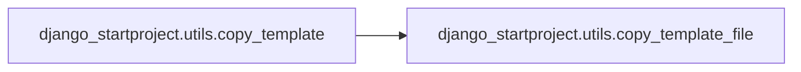

# Django Startproject Utils

[_Documentation generated by Documatic_](https://www.documatic.com)

<!---Documatic-section-Codebase Structure-start--->
## Codebase Structure

<!---Documatic-block-system_architecture-start--->
```mermaid
None
```
<!---Documatic-block-system_architecture-end--->

# #
<!---Documatic-section-Codebase Structure-end--->

<!---Documatic-section-django_startproject.utils.copy_template-start--->
## django_startproject.utils.copy_template

<!---Documatic-section-copy_template-start--->


### Object Calls

* django_startproject.utils.copy_template_file

<!---Documatic-block-django_startproject.utils.copy_template-start--->
<details>
	<summary><code>django_startproject.utils.copy_template</code> code snippet</summary>

```python
def copy_template(src, dest, replace=None):
    for (path, dirs, files) in os.walk(src):
        relative_path = path[len(src):].lstrip(os.sep)
        for (old_val, new_val) in replace.items():
            relative_path = relative_path.replace(old_val, new_val)
        os.mkdir(os.path.join(dest, relative_path))
        for (i, subdir) in enumerate(dirs):
            if subdir.startswith('.'):
                del dirs[i]
        for filename in files:
            if filename.startswith('.startproject') or filename.endswith('.pyc'):
                continue
            src_file_path = os.path.join(path, filename)
            for (old_val, new_val) in replace.items():
                filename = filename.replace(old_val, new_val)
            dest_file_path = os.path.join(dest, relative_path, filename)
            copy_template_file(src_file_path, dest_file_path, replace)
```
</details>
<!---Documatic-block-django_startproject.utils.copy_template-end--->
<!---Documatic-section-copy_template-end--->

# #
<!---Documatic-section-django_startproject.utils.copy_template-end--->

<!---Documatic-section-django_startproject.utils.copy_template_file-start--->
## django_startproject.utils.copy_template_file

<!---Documatic-section-copy_template_file-start--->
<!---Documatic-block-django_startproject.utils.copy_template_file-start--->
<details>
	<summary><code>django_startproject.utils.copy_template_file</code> code snippet</summary>

```python
def copy_template_file(src, dest, replace=None):
    replace = replace or {}
    src_file = open(src, 'r')
    data = src_file.read()
    src_file.close()
    for (old_val, new_val) in replace.items():
        data = data.replace(old_val, new_val)
    secret_key = ''.join([choice('abcdefghijklmnopqrstuvwxyz0123456789!@#$%^&*(-_=+)') for i in range(50)])
    data = re.sub("(?<=SECRET_KEY = ')'", secret_key + "'", data)
    dest_file = open(dest, 'w')
    dest_file.write(data)
    dest_file.close()
    shutil.copymode(src, dest)
    if os.access(dest, os.W_OK):
        st = os.stat(dest)
        new_permissions = stat.S_IMODE(st.st_mode) | stat.S_IWUSR
        os.chmod(dest, new_permissions)
```
</details>
<!---Documatic-block-django_startproject.utils.copy_template_file-end--->
<!---Documatic-section-copy_template_file-end--->

# #
<!---Documatic-section-django_startproject.utils.copy_template_file-end--->

<!---Documatic-section-django_startproject.utils.get_boilerplate-start--->
## django_startproject.utils.get_boilerplate

<!---Documatic-section-get_boilerplate-start--->
<!---Documatic-block-django_startproject.utils.get_boilerplate-start--->
<details>
	<summary><code>django_startproject.utils.get_boilerplate</code> code snippet</summary>

```python
def get_boilerplate(path, project_name):
    defaults = {}
    defaults_path = os.path.join(path, '.startproject_defaults')
    if os.path.isfile(defaults_path):
        defaults_file = open(defaults_path, 'r')
        for line in defaults_file:
            match = re.match('\\s*(\\w+)\\s*(.*)$', line)
            if match:
                (var, default) = match.groups()
                defaults[var] = default
    boilerplate = []
    boilerplate_path = os.path.join(path, '.startproject_boilerplate')
    if os.path.isfile(boilerplate_path):
        boilerplate_file = open(boilerplate_path, 'r')
        for line in boilerplate_file:
            match = re.match('\\s*(\\w+)\\s*(.*)$', line)
            if match:
                (var, description) = match.groups()
                default = defaults.get(var)
                boilerplate.append((var, description, default))
    return boilerplate
```
</details>
<!---Documatic-block-django_startproject.utils.get_boilerplate-end--->
<!---Documatic-section-get_boilerplate-end--->

# #
<!---Documatic-section-django_startproject.utils.get_boilerplate-end--->

[_Documentation generated by Documatic_](https://www.documatic.com)