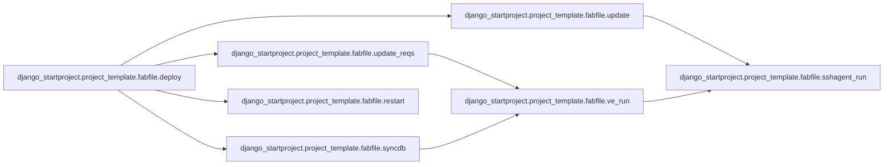
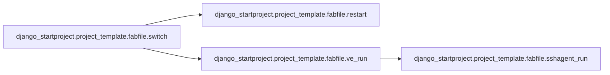
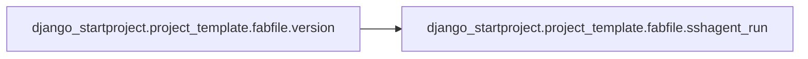
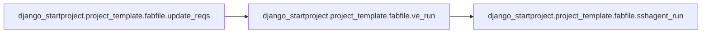
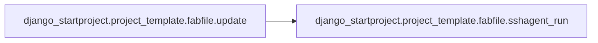
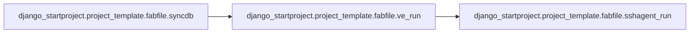
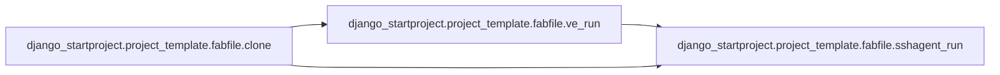
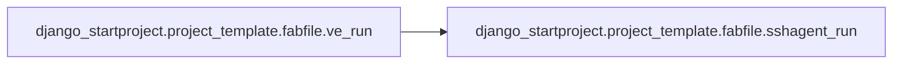

# Django Startproject Project Template

[_Documentation generated by Documatic_](https://www.documatic.com)

<!---Documatic-section-Codebase Structure-start--->
## Codebase Structure

<!---Documatic-block-system_architecture-start--->
```mermaid
None
```
<!---Documatic-block-system_architecture-end--->

# #
<!---Documatic-section-Codebase Structure-end--->

<!---Documatic-section-django_startproject.project_template.fabfile.deploy-start--->
## django_startproject.project_template.fabfile.deploy

<!---Documatic-section-deploy-start--->


### Object Calls

* django_startproject.project_template.fabfile.update
* django_startproject.project_template.fabfile.update_reqs
* django_startproject.project_template.fabfile.syncdb
* django_startproject.project_template.fabfile.restart

<!---Documatic-block-django_startproject.project_template.fabfile.deploy-start--->
<details>
	<summary><code>django_startproject.project_template.fabfile.deploy</code> code snippet</summary>

```python
def deploy():
    update()
    update_reqs()
    syncdb()
    restart()
```
</details>
<!---Documatic-block-django_startproject.project_template.fabfile.deploy-end--->
<!---Documatic-section-deploy-end--->

# #
<!---Documatic-section-django_startproject.project_template.fabfile.deploy-end--->

<!---Documatic-section-django_startproject.project_template.fabfile.switch-start--->
## django_startproject.project_template.fabfile.switch

<!---Documatic-section-switch-start--->


### Object Calls

* django_startproject.project_template.fabfile.restart
* django_startproject.project_template.fabfile.ve_run

<!---Documatic-block-django_startproject.project_template.fabfile.switch-start--->
<details>
	<summary><code>django_startproject.project_template.fabfile.switch</code> code snippet</summary>

```python
def switch(branch):
    with cd(env.proj_root):
        ve_run('git checkout %s' % branch)
    restart()
```
</details>
<!---Documatic-block-django_startproject.project_template.fabfile.switch-end--->
<!---Documatic-section-switch-end--->

# #
<!---Documatic-section-django_startproject.project_template.fabfile.switch-end--->

<!---Documatic-section-django_startproject.project_template.fabfile.version-start--->
## django_startproject.project_template.fabfile.version

<!---Documatic-section-version-start--->


### Object Calls

* django_startproject.project_template.fabfile.sshagent_run

<!---Documatic-block-django_startproject.project_template.fabfile.version-start--->
<details>
	<summary><code>django_startproject.project_template.fabfile.version</code> code snippet</summary>

```python
def version():
    with cd(env.proj_root):
        sshagent_run('git log -1')
```
</details>
<!---Documatic-block-django_startproject.project_template.fabfile.version-end--->
<!---Documatic-section-version-end--->

# #
<!---Documatic-section-django_startproject.project_template.fabfile.version-end--->

<!---Documatic-section-django_startproject.project_template.fabfile.restart-start--->
## django_startproject.project_template.fabfile.restart

<!---Documatic-section-restart-start--->
<!---Documatic-block-django_startproject.project_template.fabfile.restart-start--->
<details>
	<summary><code>django_startproject.project_template.fabfile.restart</code> code snippet</summary>

```python
def restart():
    run('touch %s/etc/apache/django.wsgi' % env.root)
```
</details>
<!---Documatic-block-django_startproject.project_template.fabfile.restart-end--->
<!---Documatic-section-restart-end--->

# #
<!---Documatic-section-django_startproject.project_template.fabfile.restart-end--->

<!---Documatic-section-django_startproject.project_template.fabfile.update_reqs-start--->
## django_startproject.project_template.fabfile.update_reqs

<!---Documatic-section-update_reqs-start--->


### Object Calls

* django_startproject.project_template.fabfile.ve_run

<!---Documatic-block-django_startproject.project_template.fabfile.update_reqs-start--->
<details>
	<summary><code>django_startproject.project_template.fabfile.update_reqs</code> code snippet</summary>

```python
def update_reqs():
    ve_run('yes w | pip install -r %s' % env.pip_file)
```
</details>
<!---Documatic-block-django_startproject.project_template.fabfile.update_reqs-end--->
<!---Documatic-section-update_reqs-end--->

# #
<!---Documatic-section-django_startproject.project_template.fabfile.update_reqs-end--->

<!---Documatic-section-django_startproject.project_template.fabfile.update-start--->
## django_startproject.project_template.fabfile.update

<!---Documatic-section-update-start--->


### Object Calls

* django_startproject.project_template.fabfile.sshagent_run

<!---Documatic-block-django_startproject.project_template.fabfile.update-start--->
<details>
	<summary><code>django_startproject.project_template.fabfile.update</code> code snippet</summary>

```python
def update():
    with cd(env.proj_root):
        sshagent_run('git pull')
```
</details>
<!---Documatic-block-django_startproject.project_template.fabfile.update-end--->
<!---Documatic-section-update-end--->

# #
<!---Documatic-section-django_startproject.project_template.fabfile.update-end--->

<!---Documatic-section-django_startproject.project_template.fabfile.syncdb-start--->
## django_startproject.project_template.fabfile.syncdb

<!---Documatic-section-syncdb-start--->


### Object Calls

* django_startproject.project_template.fabfile.ve_run

<!---Documatic-block-django_startproject.project_template.fabfile.syncdb-start--->
<details>
	<summary><code>django_startproject.project_template.fabfile.syncdb</code> code snippet</summary>

```python
def syncdb():
    ve_run('manage.py syncdb --migrate')
```
</details>
<!---Documatic-block-django_startproject.project_template.fabfile.syncdb-end--->
<!---Documatic-section-syncdb-end--->

# #
<!---Documatic-section-django_startproject.project_template.fabfile.syncdb-end--->

<!---Documatic-section-django_startproject.project_template.fabfile.clone-start--->
## django_startproject.project_template.fabfile.clone

<!---Documatic-section-clone-start--->


### Object Calls

* django_startproject.project_template.fabfile.ve_run
* django_startproject.project_template.fabfile.sshagent_run

<!---Documatic-block-django_startproject.project_template.fabfile.clone-start--->
<details>
	<summary><code>django_startproject.project_template.fabfile.clone</code> code snippet</summary>

```python
def clone():
    with cd('%s/src' % env.root):
        sshagent_run('git clone %s' % env.proj_repo)
    ve_run('pip install -e %s' % env.proj_root)
    with cd('%s/myproject/conf/local' % env.proj_root):
        run('ln -s ../dev/__init__.py')
        run('ln -s ../dev/settings.py')
```
</details>
<!---Documatic-block-django_startproject.project_template.fabfile.clone-end--->
<!---Documatic-section-clone-end--->

# #
<!---Documatic-section-django_startproject.project_template.fabfile.clone-end--->

<!---Documatic-section-django_startproject.project_template.fabfile.ve_run-start--->
## django_startproject.project_template.fabfile.ve_run

<!---Documatic-section-ve_run-start--->


### Object Calls

* django_startproject.project_template.fabfile.sshagent_run

<!---Documatic-block-django_startproject.project_template.fabfile.ve_run-start--->
<details>
	<summary><code>django_startproject.project_template.fabfile.ve_run</code> code snippet</summary>

```python
def ve_run(cmd):
    require('root')
    return sshagent_run('source %s/bin/activate; %s' % (env.root, cmd))
```
</details>
<!---Documatic-block-django_startproject.project_template.fabfile.ve_run-end--->
<!---Documatic-section-ve_run-end--->

# #
<!---Documatic-section-django_startproject.project_template.fabfile.ve_run-end--->

<!---Documatic-section-django_startproject.project_template.fabfile.sshagent_run-start--->
## django_startproject.project_template.fabfile.sshagent_run

<!---Documatic-section-sshagent_run-start--->
<!---Documatic-block-django_startproject.project_template.fabfile.sshagent_run-start--->
<details>
	<summary><code>django_startproject.project_template.fabfile.sshagent_run</code> code snippet</summary>

```python
def sshagent_run(cmd):
    wrapped_cmd = _prefix_commands(_prefix_env_vars(cmd), 'remote')
    try:
        (host, port) = env.host_string.split(':')
        return local("ssh -p %s -A %s@%s '%s'" % (port, env.user, host, wrapped_cmd))
    except ValueError:
        return local("ssh -A %s@%s '%s'" % (env.user, env.host_string, wrapped_cmd))
```
</details>
<!---Documatic-block-django_startproject.project_template.fabfile.sshagent_run-end--->
<!---Documatic-section-sshagent_run-end--->

# #
<!---Documatic-section-django_startproject.project_template.fabfile.sshagent_run-end--->

<!---Documatic-section-django_startproject.project_template.myproject.bin.manage.has_settings_option-start--->
## django_startproject.project_template.myproject.bin.manage.has_settings_option

<!---Documatic-section-has_settings_option-start--->
<!---Documatic-block-django_startproject.project_template.myproject.bin.manage.has_settings_option-start--->
<details>
	<summary><code>django_startproject.project_template.myproject.bin.manage.has_settings_option</code> code snippet</summary>

```python
def has_settings_option():
    parser = LaxOptionParser(usage='%prog subcommand [options] [args]', version=get_version(), option_list=BaseCommand.option_list)
    try:
        options = parser.parse_args(sys.argv[:])[0]
    except:
        return False
    return bool(options.settings)
```
</details>
<!---Documatic-block-django_startproject.project_template.myproject.bin.manage.has_settings_option-end--->
<!---Documatic-section-has_settings_option-end--->

# #
<!---Documatic-section-django_startproject.project_template.myproject.bin.manage.has_settings_option-end--->

[_Documentation generated by Documatic_](https://www.documatic.com)